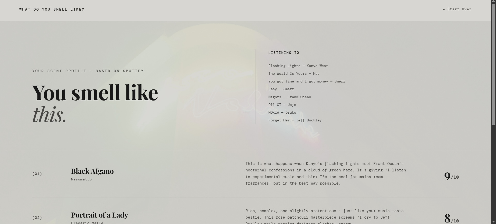

# Music to Perfume

A web app that turns your Spotify listening history into perfume recommendations with unnervingly specific emotional accuracy.

---

## What It Does

Connect your Spotify account. The app pulls your top tracks, extracts emotional patterns and aesthetic signals from your listening history, and uses Claude to suggest 5 perfumes that match your vibe, each with a score, description, and atmospheric mood image.

The tone is esoteric and specific. Not "you like pop so here's a floral." More like: *"you'd wear this at 2am in a city you don't live in anymore."*

---

## Demo

**Results page:**


**Walkthrough video (up to loading screen):**
[Watch on YouTube](https://youtu.be/pDFNOlWUXqo)

---

## Tech Stack

- **Python** + **Flask** — backend and routing
- **Spotipy** — Spotify API integration (top tracks, artist genres)
- **Anthropic Claude API** — AI-powered perfume matching and descriptions
- **Unsplash API** — mood-matched atmospheric images
- **HTML / CSS / JavaScript** — custom editorial frontend, no frameworks

---

## Features

- Spotify OAuth login
- Pulls your top 20 tracks and artist genres
- AI analyzes listening patterns to infer mood and aesthetic profile
- Returns 5 perfume recommendations scored and described with a distinct mood and narrative
- Click-through detail pages with full-screen mood images
- Animated loading screen with progress steps
- Editorial UI inspired by fashion and fragrance magazines

---

## Setup

1. Clone the repo
```bash
git clone https://github.com/Darzha/Music-to-Perfume
cd Music-to-Perfume
```

2. Install dependencies
```bash
pip install -r requirements.txt
```

3. Create a `.env` file in the root directory
```
SPOTIFY_CLIENT_ID=your_spotify_client_id
SPOTIFY_CLIENT_SECRET=your_spotify_client_secret
SPOTIFY_REDIRECT_URI=http://127.0.0.1:8888/callback
ANTHROPIC_API_KEY=your_anthropic_key
UNSPLASH_ACCESS_KEY=your_unsplash_key
SECRET_KEY=your_secret_key
```

4. Run the app
```bash
python app.py
```

5. Open `http://127.0.0.1:8888` in your browser

---

## API Keys Required

| Service | Link | Free Tier |
|---|---|---|
| Spotify | [developer.spotify.com](https://developer.spotify.com) | Yes |
| Anthropic | [console.anthropic.com](https://console.anthropic.com) | Paid (cheap) |
| Unsplash | [unsplash.com/developers](https://unsplash.com/developers) | Yes |

---

## Note on Spotify Access

Currently in Spotify dev mode. If you want access, open an issue or message me and I'll add you.

---

*A small experiment in translating taste across senses, from sound into scent.*
